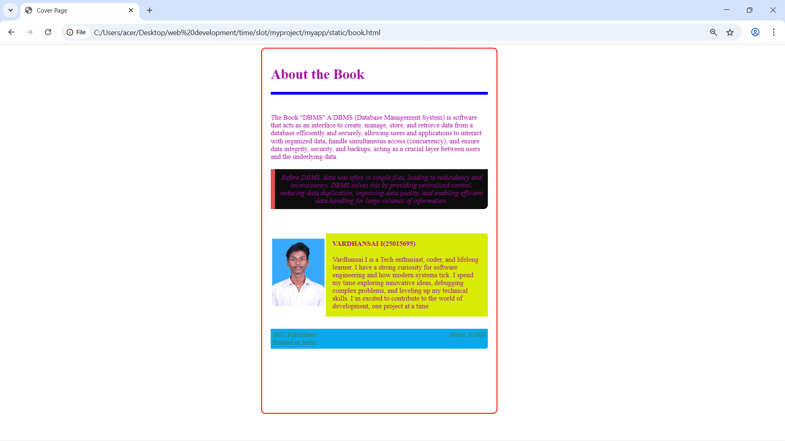

# Ex.05 Book Cover Page Design
## Date:28/12/2025

## AIM:
To design a book back cover page using HTML and CSS.

## DESIGN STEPS:

### Step 1:
Create a Django Admin project.

### Step 2:
Create an app in the Django interface.

### Step 3:
Create a folder named 'static' in the app folder.

### Step 4:
Create a new HTML file in the static folder.

### Step 5:
Write the HTML code with relevant CSS properties.

### Step 6:
Choose the appropriate style and color scheme.

### Step 7:
Insert the images in their appropriate places.

### Step 8:
Publish the website in the LocalHost.

## PROGRAM:

book.html
```
<html>
    <head>
        <title>Cover Page</title>
        <link href="styles.css" rel="stylesheet">
    </head>
    <body >
        <div class="description">
            <h1>About the Book</h1>
            <hr color="blue" size="6">

      
            <br>
            <br>
            The Book <span class="color">"DBMS"</span> A DBMS (Database Management System) is software that acts as an interface to create, manage, store, and retrieve data from a database efficiently and securely, allowing users and applications to interact with organized data, handle simultaneous access (concurrency), and ensure data integrity, security, and backups, acting as a crucial layer between users and the underlying data.  

            
            <div class="quote">
                Before DBMS, data was often in simple files, leading to redundancy and inconsistency. DBMS solves this by providing centralized control, reducing data duplication, improving data quality, and enabling efficient data handling for large volumes of information.           </div>
            <br>
            <br>
        
            
            
            <div class="ifo">
                
                <div class="protofolio">
                    <b>VARDHANSAI I(25015695)</b>
                    <br><br>
                    Vardhansai I is a Tech enthusiast, coder, and lifelong learner. I have a strong curiosity for software engineering and how modern systems tick. I spend my time exploring innovative ideas, debugging complex problems, and leveling up my technical skills. I’m excited to contribute to the world of development, one project at a time
                </div>
            </div>
            <br>
            
            <div class="footer">
                SEC Publishers <br> Printed in India
                <br>
                <div class="Price">
                Price: $1000
                </div>      
                   
            </div>
        </div>
    </body>
</html>
```
style.css
```
body {
            font-size: Arial;
            
        }
        .description
            {
            height: 800px;
            width: 500px;
            background-image:url(book.jpeg);
            background-size: cover;
            color:rgb(164, 14, 159);
            padding: 20px;
            margin: 30px auto;
            border: 2px solid red;
            border-radius: 10px;
        }
        .quote {
            background: rgb(13, 13, 13);
            padding: 10px;
            border-left: 10px solid rgb(231, 78, 83);
            margin: 20px 0;
            font-style: italic;
            text-align: center;
            border-end-end-radius: 10px;
        }
        .ifo
        {
            display: flex;
        }
        .protofolio 
        {
            background:rgb(216, 235, 6);
            gap: 25px;
            padding: 15px;
            border-start-end-radius: 5px;
        }
    
        .footer {
            background:rgb(9, 169, 233);
            color: rgb(57, 125, 79);
            padding: 5px;
            display: flex;
            justify-content: space-between;
            margin-top: 10px;
            border-end-end-radius: 5px;
        }
```

## OUTPUT:



## RESULT:
The program for designing book back cover page using HTML and CSS is completed successfully.
